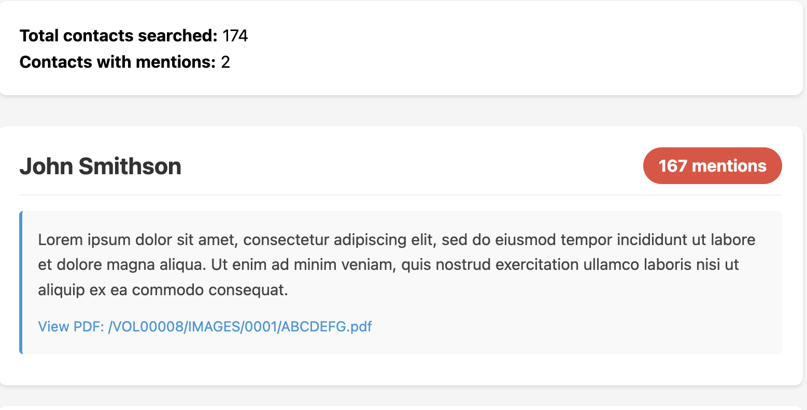

Search the publicly released Epstein court documents for mentions of your LinkedIn connections and/or X/Twitter following list.

## Requirements

- Python 3.6+
- `requests` library

## Setup

```bash
git clone git@github.com:cfinke/EpsteIn.git
cd EpsteIn/
python3 -m venv project_venv
source project_venv/bin/activate
pip install -r requirements.txt
```

## Getting Your LinkedIn Contacts

1. Go to [linkedin.com](https://www.linkedin.com) and log in.
2. Click your profile icon in the top right.
3. Select **Settings & Privacy**.
4. Click **Data privacy** in the left sidebar.
5. Under "How LinkedIn uses your data", click **Get a copy of your data**.
6. Select **Connections** (or click "Want something in particular?" and check Connections). If **Connections** isn't listed as an option, choose the **Download larger data archive** option.
7. Click **Request archive**.
8. Wait for LinkedIn's email; it may take up to 24 hours.
9. Download and extract the ZIP file.
10. Locate the `Connections.csv` file.

## Getting Your X/Twitter Following List

1. Go to [x.com](https://x.com) and log in.
2. Navigate to **Settings and privacy** > **Your Account** > **Download an archive of your data**.
3. Verify your identity and click **Request archive**.
4. Wait for X's email (may take 24+ hours).
5. Download and extract the archive ZIP file.
6. Locate `data/following.js` in the extracted archive.

### Setting Up an X API Bearer Token

To resolve account IDs to display names, you need an X API bearer token:

1. Go to the [X Developer Portal](https://developer.x.com/) and create a project/app.
2. Generate a **Bearer Token** from your app's "Keys and tokens" page.
3. Provide it via `--x-bearer-token` or the `X_BEARER_TOKEN` environment variable.

## Usage

```bash
# LinkedIn only
python EpsteIn.py --connections /path/to/Connections.csv

# X/Twitter only
python EpsteIn.py --x-following /path/to/following.js --x-bearer-token YOUR_TOKEN

# Both sources combined
python EpsteIn.py --connections Connections.csv --x-following following.js --x-bearer-token YOUR_TOKEN
```

### Options

| Flag | Description |
|------|-------------|
| `--connections`, `-c` | Path to LinkedIn Connections.csv export |
| `--x-following` | Path to X/Twitter data export `following.js` |
| `--x-bearer-token` | X API bearer token (or set `X_BEARER_TOKEN` env var) |
| `--output`, `-o` | Output HTML file path (default: `EpsteIn.html`) |

At least one contact source (`--connections` or `--x-following`) is required.

### Examples

LinkedIn only:
```bash
python EpsteIn.py --connections ~/Downloads/Connections.csv
```

X/Twitter only:
```bash
export X_BEARER_TOKEN="your_token_here"
python EpsteIn.py --x-following ~/Downloads/twitter-archive/data/following.js
```

Both sources with custom output:
```bash
python EpsteIn.py --connections Connections.csv --x-following following.js --x-bearer-token TOKEN --output my_report.html
```

## Reading the Output

The script generates an HTML report (`EpsteIn.html` by default) that you can open in any web browser.



The report contains:

- **Summary**: Total contacts searched and how many had mentions
- **Contact cards**: Each contact with mentions is displayed as a card showing:
  - Name, position, and company
  - Total number of mentions across all documents
  - Excerpts from each matching document
  - Links to the source PDFs on justice.gov

Contacts are sorted by number of mentions (highest first).

## Notes

- The search uses exact phrase matching on full names, so "John Smith" won't match documents that only contain "John" or "Smith" separately.
- Common names may produce false positives; review the context excerpts to verify relevance.
- Epstein files indexed by [DugganUSA.com](https://dugganusa.com)

